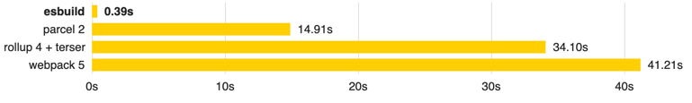

* esbuild bundler
  * 👀:= extremely fast bundler for the web 👀
    * _Example:_ see [FAQ](faq.md#benchmark-details)
        
  * goal
    * NEW era of build tool performance
    * create an easy-to-use modern bundler
  * features 
    * EXTREME speed / NO need to cache
    * built-in
      * [JavaScript](content-types.md#javascript),
      * [CSS](content-types.md#css),
      * [TypeScript](content-types.md#typescript),
      * [JSX](content-types.md#jsx)
    * [API](api.md) -- for --
      * CLI,
      * JS,
      * Go
    * Bundles
      * modules
        * ESM
        * CommonJS
      * CSS -- including -- [CSS modules](https://github.com/css-modules/css-modules)
    * Tree shaking, [minification](api.md#minify), and [source maps](api.md#sourcemap)
    * [Local server](api.md#serve), [watch mode](api.md#watch), and [plugins](plugins.md)
